# UT01.- Prueba de aplicaciones web y para dispositivos móviles

## 1. Documentación y prueba del programa

### Apartado 1. Añade los comentarios al código de la aplicación indicando para que sirven las diferentes sentencias, funciones, etc.

A continuacion podemos ver en captura de pantallas el codigo comentado

Estas primeras capturas de pantalla corresponden al lavadero.py 

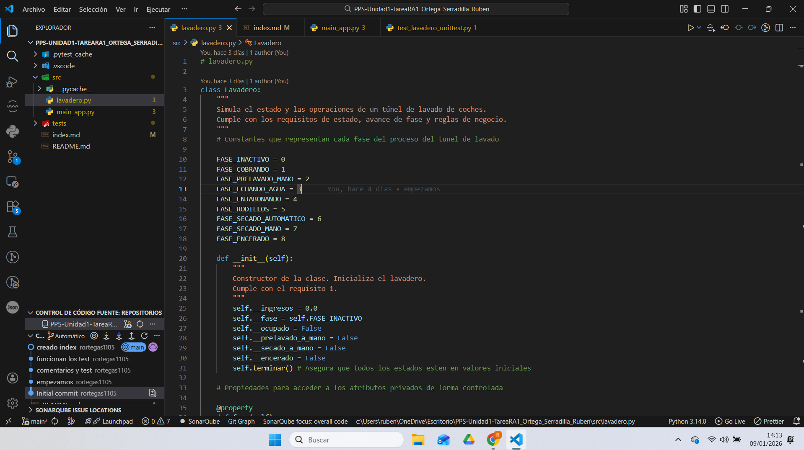

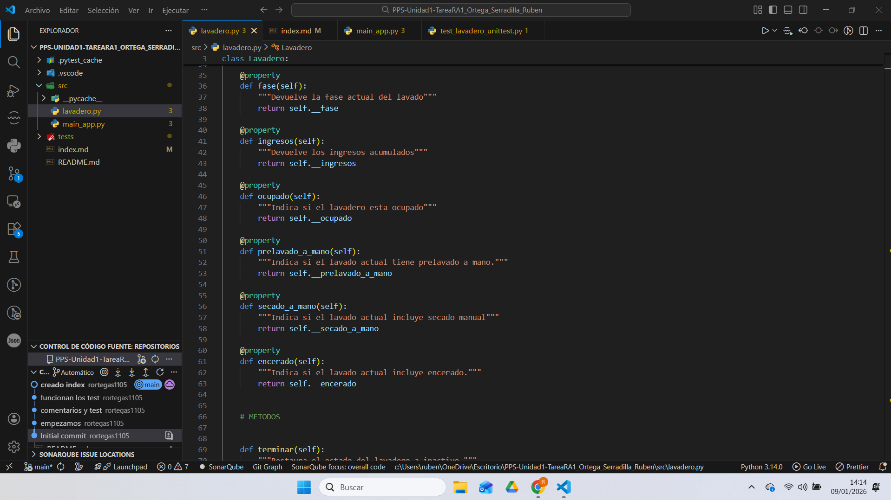

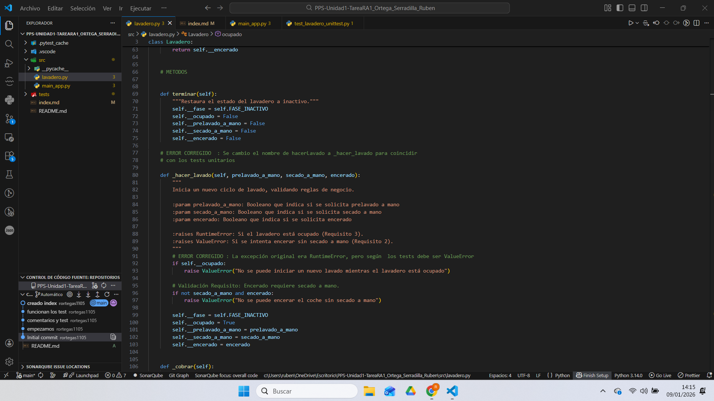

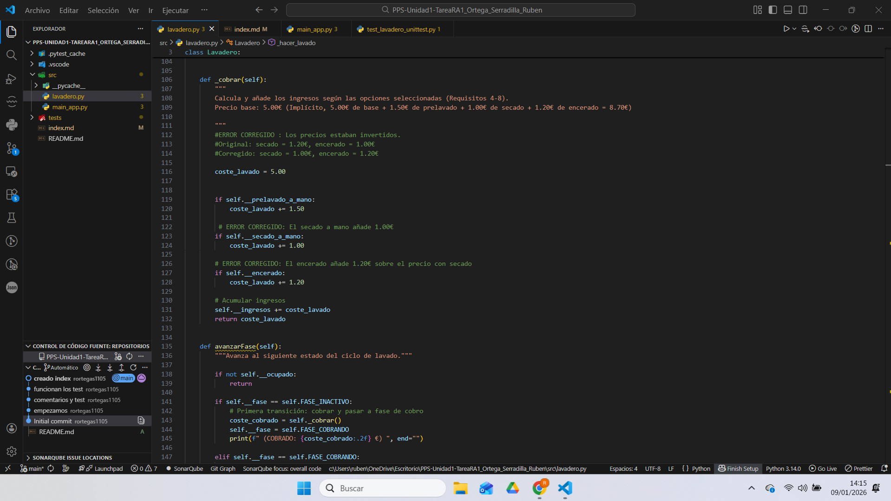

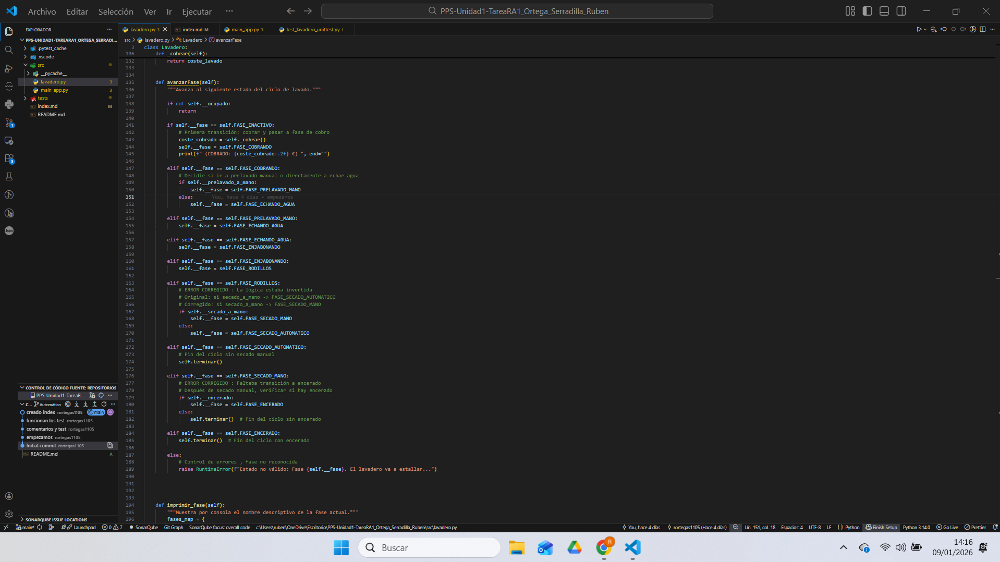

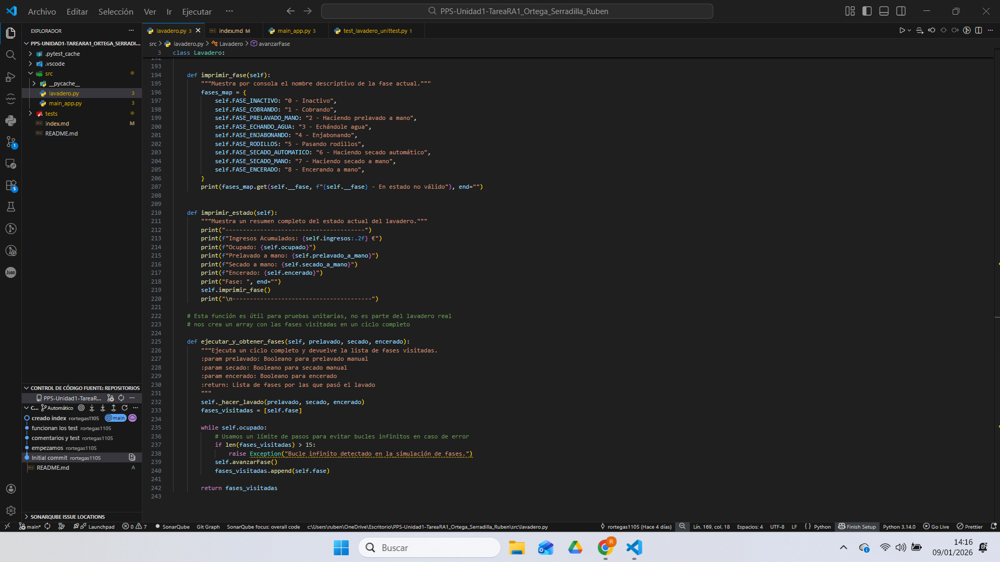

Las siguientes imagenes corresponden a main_app.py

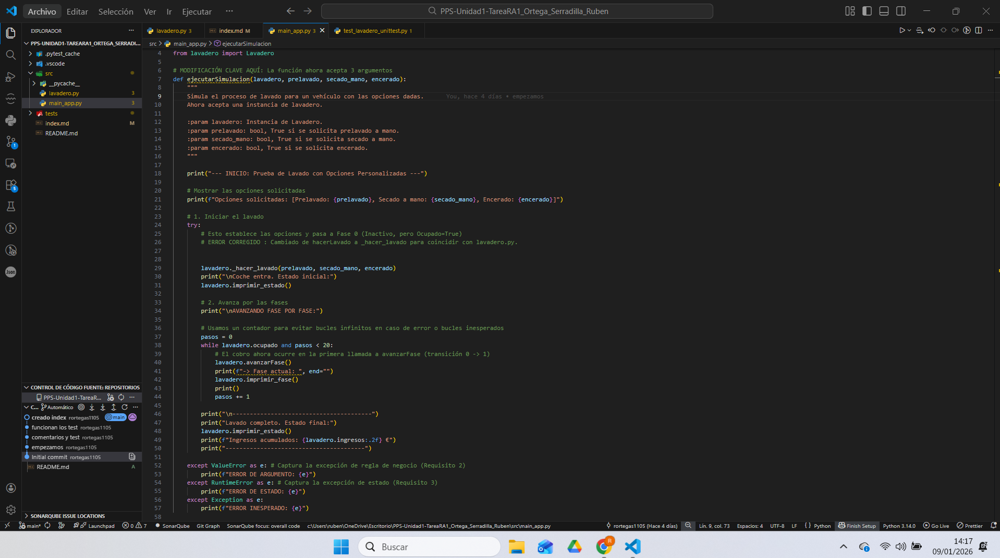

## Apartado 2. Ejecuta el programa mediante las opciones de Ejecución y Depuración del IDE.

El codigo tenia una serie de errores que he solucionado, los errores son los siguientes:

### Error 1: Tipo de Excepción Incorrecto
Archivo: lavadero.py, método _hacer_lavado (originalmente hacerLavado)
Descripción: Se lanzaba RuntimeError cuando el lavadero estaba ocupado, pero según los tests unitarios debe ser ValueError
Solución: Cambiar a raise ValueError(...)

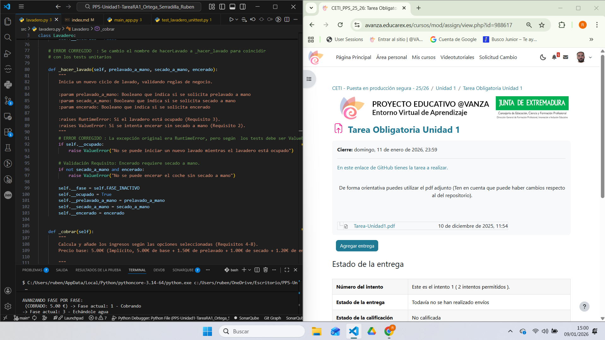

### Error 2: Precios Invertidos en el Método _cobrar
Archivo: lavadero.py, método _cobrar
Descripción: Los incrementos de precio para secado manual (1.20€) y encerado (1.00€) estaban intercambiados
Solución: Intercambiar los valores para que secado sea +1.00€ y encerado +1.20€

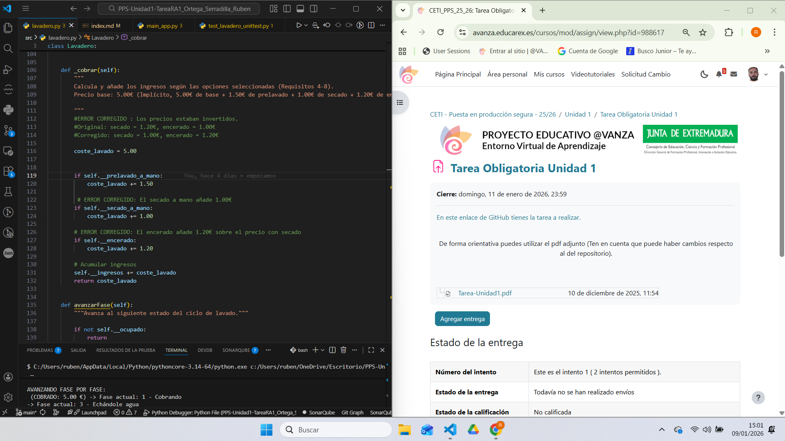

### Error 3: Lógica Invertida en Transición de Fases
Archivo: lavadero.py, método avanzarFase, transición desde FASE_RODILLOS
Descripción: La condición para decidir entre secado automático y manual estaba invertida
Solución: Invertir la lógica de la condición

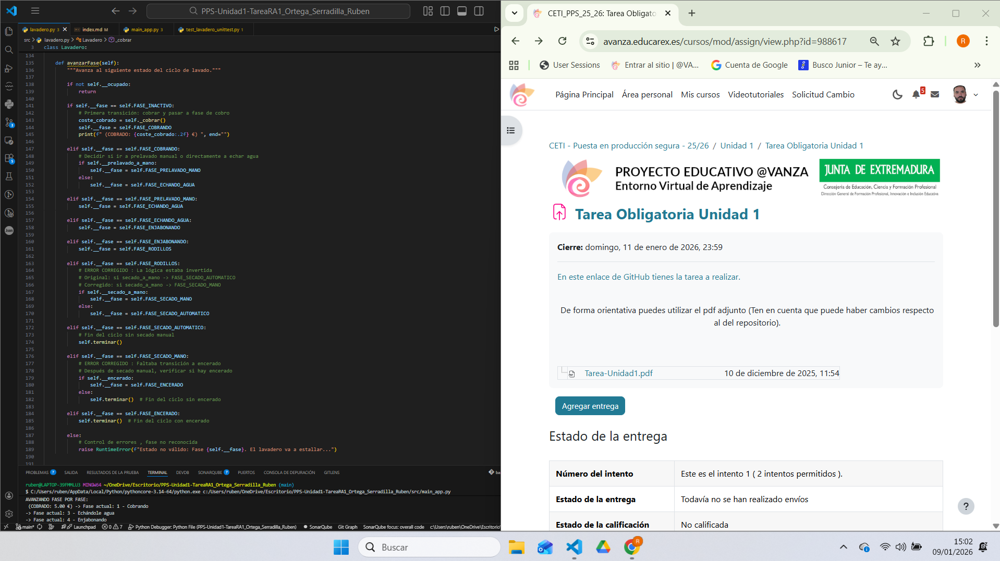

### Error 4: Falta Transición a Fase de Encerado
Archivo: lavadero.py, método avanzarFase, transición desde FASE_SECADO_MANO
Descripción: Después del secado manual, no se verificaba si había que pasar a encerado
Solución: Añadir condición para pasar a FASE_ENCERADO si está activado

### Error 5: Método Público vs Privado Inconsistente
Archivo: lavadero.py y main_app.py
Descripción: Los tests usaban _hacer_lavado pero el código principal usaba hacerLavado
Solución: Crear ambos métodos, siendo _hacer_lavado el interno y hacerLavado el público

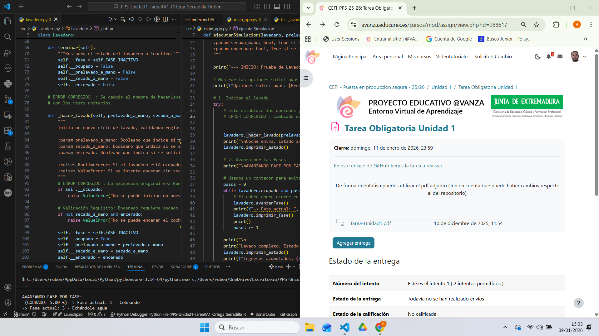

### Error 6: Parámetro Faltante en Llamada a Función
Archivo: main_app.py, último ejemplo
Descripción: Faltaba el parámetro encerado en la llamada a ejecutarSimulacion
Solución: Añadir el parámetro faltante: encerado=False

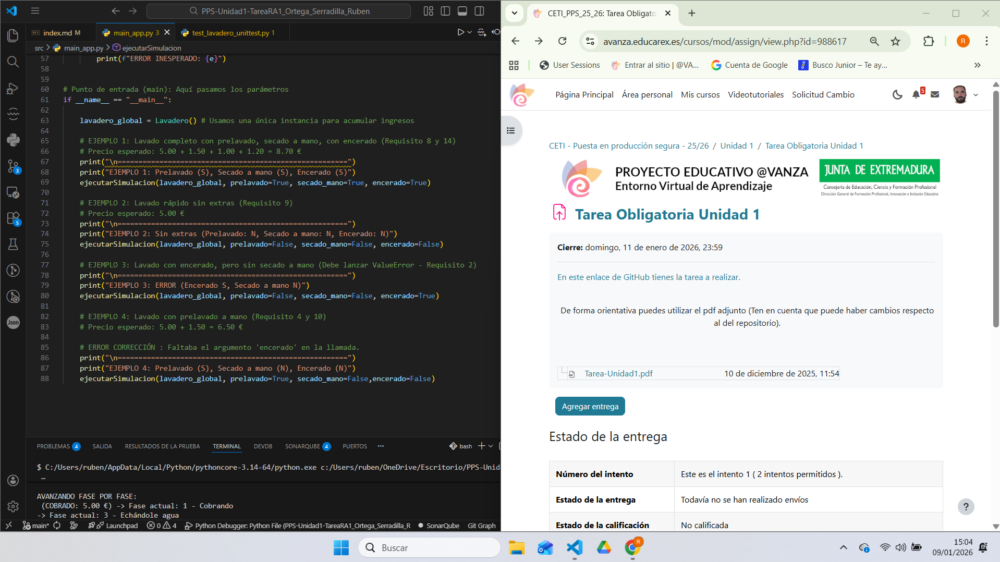

En la siguiente pantalla podemos ver como funciona correctamente despues de solucionar los errores 

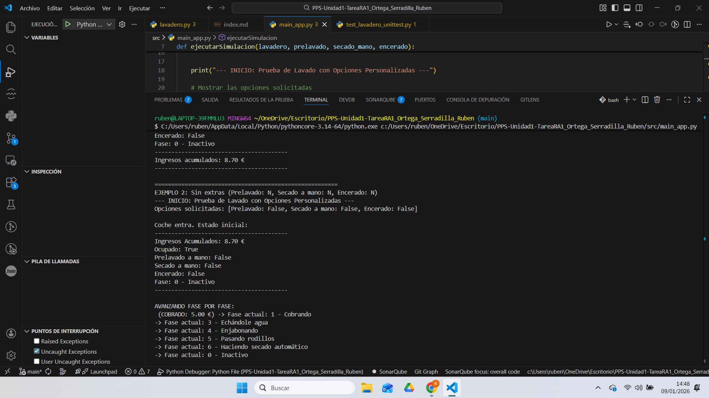

## 2. Realización de los test unitarios de la aplicación.

## Apartado 3: Ejecuta los test

A continuacion se puede ver en las capturas de pantallas los tests que se han realizado 

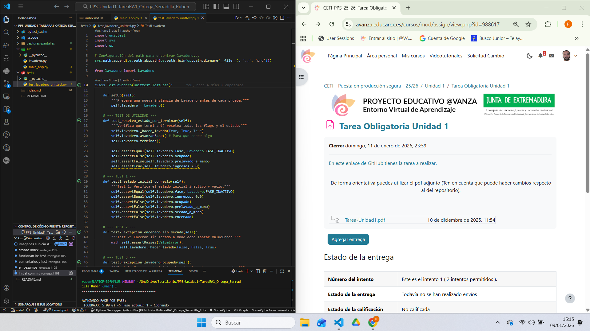

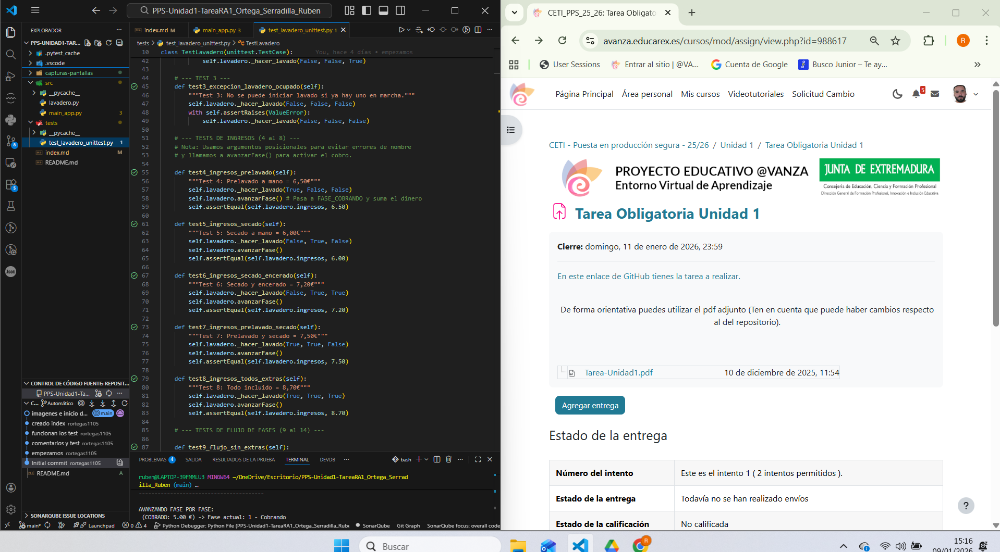

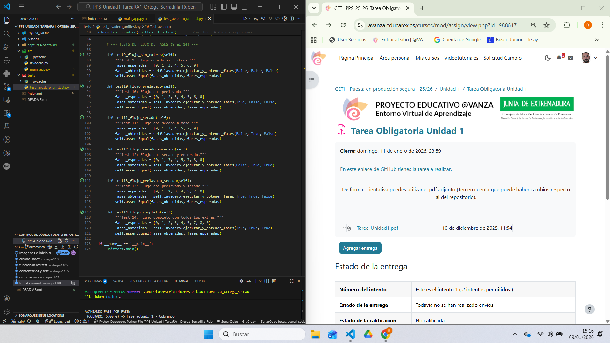

los errores encontrados los he nombrado en el apartado anterior [Apartado 2. Ejecuta el programa mediante las opciones de Ejecución y Depuración del IDE.]

Despues de solucionar los errores ya se pueden ejecutar correctamente los tests

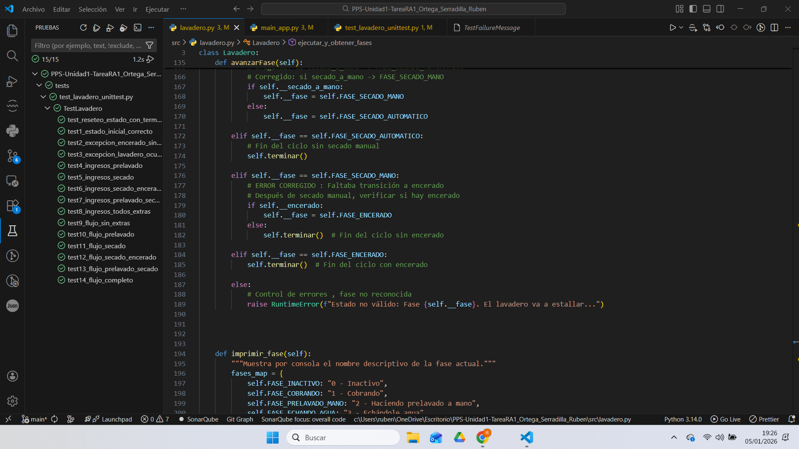

## 3. Ejecución de la aplicación en un entorno
controlado
## Apartado 4: Ejecuta la aplicación en un entorno controlado (Sandbox).

La verdad que el que mas me interesaba era el windows sandbox pero me ha dado problemas y al final he utilizado el sandboxie-plus

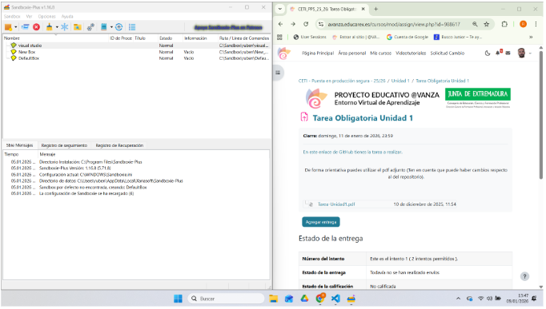

## 4. Reflexión sobre comparación de la infraestructura de seguridad de los lenguajes.

### Apartado 5. Has podido leer en los contenidos teóricoslas medidas de seguridad que incorporan algunos de los lenguajes. Escribe una reflexión personal acerca de ellos.

Después de leer sobre las medidas de seguridad de distintos lenguajes, me he dado cuenta de que cada uno protege el código de forma diferente.
Python, por ejemplo, es bastante seguro en el día a día porque gestiona la memoria de forma automática y evita muchos errores típicos. Aun así, su seguridad depende mucho del entorno donde se ejecute, ya que no tiene un sistema propio que verifique el código, así que es mejor usarlo dentro de entornos virtuales o sandbox para evitar problemas.

Java es, sin duda, uno de los más completos en cuanto a seguridad. Su máquina virtual revisa el código antes de ejecutarlo, permite firmar archivos para comprobar su origen y tiene varias librerías que ayudan a mantener las comunicaciones seguras.
El entorno .NET sigue un enfoque parecido, controlando los permisos y la seguridad desde su propia máquina virtual.

En cambio, PHP depende más del servidor donde se ejecuta. Si no se configura bien, puede ser más vulnerable, aunque con buenas prácticas también puede ser bastante estable.

En resumen, para mí Java y Python son los más equilibrados: Java por su sistema de seguridad tan completo, y Python por ser sencillo y fiable si se usa correctamente. Al final, la seguridad no solo depende del lenguaje, sino también de cómo se programe y del entorno donde se use.